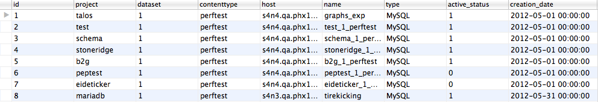

Architecture
==============
At a top level datazilla consists of four components: Model, Web Service, User Interface, and Data Model.

Model
----------
The model layer found in /datazilla/model provides an interface for getting/setting data in a database. The datazilla model classes rely on a module called datasource. This module encapsulates SQL manipulation. All of the SQL used by the system is stored in a JSON file found in /datazilla/model/sql. There can be any number of SQL files stored in this format. The JSON structure allows SQL to be stored in named associative arrays that also contain the host type to be associated with each statement. Any command line script or web service method that requires data should use a derived model class to obtain it. ::


    gm = DatazillaModel('graphs.json')
    products = gm.getProductTestOsMap()

The ``gm.getProductTestOsMap()`` method looks like ::

    #python
        def getProductTestOsMap(self):
        productTuple = self.dhub.execute(proc='graphs.selects.get_product_test_os_map',debug_show=self.DEBUG,return_type='tuple')
        return productTuple

``graphs.selects.get_product_test_os_map`` found in `datazilla/model/sql/perftest.json <https://github.com/mozilla/datazilla/blob/master/datazilla/model/sql/perftest.json>`_ looks like ::

    json
    {
        "selects":{

           "get_product_test_os_map":{

              "sql":"SELECT b.product_id, tr.test_id, b.operating_system_id
                     FROM test_run AS tr
                     LEFT JOIN build AS b ON tr.build_id = b.id
                     WHERE b.product_id IN (
                       SELECT product_id
                       FROM product )
                    GROUP BY b.product_id, tr.test_id, b.operating_system_id",

               "host":"master_host"
           },

           "...more SQL statements..."
    }

The string, ``graphs``, in ``graphs.selects.get_product_test_os_map`` refers to the SQL file name to load in `/datazilla/model/sql <https://github.com/mozilla/datazilla/tree/master/datazilla/model/sql>`_.  The SQL in graphs.json can also be written with placeholders and a string replacement system, see [datasource] [5] for all of the features available.

If you're thinking why not just use an ORM?  I direct you to [seldo.com] [9] where you will find a most excellent answer to your question that I completely agree with.  It has been my experience that ORMs don't scale well with data models that need to scale horizontally.  They also fail to represent relational data accurately in OOP like objects.  If you can represent your data model with objects, then use an object store not an RDBS.  SQL answers questions.  It provides a context-sensitive representation that does not map well to OOP but works great with an API.

The approach used here keeps SQL out of your application and provides re-usability by allowing you to store SQL statements with an assigned name and statement grouping.  If the data structure retrieved from datasource requires further munging, it can be managed in the model without removing fine grained control over the SQL execution and optimization.

Web Service
-------------
The web service is a django application, found in `/datazilla/webapp/apps/datazilla <https://github.com/mozilla/datazilla/tree/master/datazilla/webapp/apps>`_.  The interface needs to be formalized further. One possible way of doing this would be to convert the methods and global data structures described below into OOP attributes and methods using a django plugin like `piston <https://bitbucket.org/jespern/django-piston/wiki/Home>`_.

A global datastructure, found in `/datazilla/webapp/apps/datazilla/views.py <https://github.com/mozilla/datazilla/blob/master/datazilla/webapp/apps/datazilla/views.py>`_ called, ``DATAVIEW_ADAPTERS``, maps all data views to a data adapter method and set of fields that correspond to signals the data views can send and receive.  This list of signals is passed to the UI as JSON embedded in a hidden input element.  There is a single data view method that manages traversal of ```DATAVIEW_ADAPTERS```, and provides default behavior for the data view service. ::

    #python
    DATAVIEW_ADAPTERS = { ##Flat tables SQL##
                          'test_run':{},
                          'test_value':{ 'fields':[ 'test_run_id', ] },
                          'test_option_values':{ 'fields':[ 'test_run_id', ] },
                          'test_aux_data':{ 'fields':[ 'test_run_id', ] },

                          ##API only##
                          'get_test_ref_data':{ 'adapter':_getTestReferenceData},

                          ##Visualization Tools##
                          'test_runs':{ 'adapter':_getTestRunSummary, 'fields':['test_run_id', 'test_run_data'] },

                          'test_chart':{ 'adapter':_getTestRunSummary, 'fields':['test_run_id', 'test_run_data'] },

                          'test_values':{ 'adapter':_getTestValues, 'fields':['test_run_id'] },

                          'page_values':{ 'adapter':_getPageValues, 'fields':['test_run_id', 'page_id'] },

                          'test_value_summary':{ 'adapter':_getTestValueSummary, 'fields':['test_run_id'] } }

The following is an example of a data adapter in the web service.  Adapters registered in ``DATAVIEW_ADAPTERS`` are automatically called with the SQL procedure path, name, and fullpath found in graphs.json assuming the name of the statement matches the key name in ``DATAVIEW_ADAPTERS``.  The keys in ``DATAVIEW_ADAPTERS`` correspond to url locations, the example adapter below can be reached at /datazilla/webapp/api/test_values. ::

    #python
    def _getTestValues(procPath, procName, fullProcPath, request, gm):

       data = {};

       if 'test_run_id' in request.GET:
          data = gm.getTestRunValues( request.GET['test_run_id'] )

       jsonData = json.dumps( data )

       return jsonData


All Datazilla configuration that is likely to vary per-deployment is found in the sample settings file `datazilla/settings/local.sample.py`; this file should be copied to `datazilla/settings/local.py` and modified as needed. There is a single setting, `DEBUG`, that can be used to turn on debugging options across all command line scripts and the web service.  When set, the following message will be written to the server log or to stdout, if executing a command line script whenever SQL is executed in the application. ::

    datasource.hubs.MySQL.MySQL debug message:
       host:hostname.somewhere.com db:db_name host_type:master_host proc:graphs.selects.get_test_run_summary
       Executing SQL:SELECT tr.id AS 'test_run_id', tr.revision, tr.date_run, b.product_id, tr.test_id, b.operating_system_id, ROUND( AVG(tv.value), 2 ) AS average, ROUND( MIN(tv.value), 2 ) AS min, ROUND( MAX(tv.value), 2 ) AS max, ROUND( STDDEV(tv.value), 2 ) AS 'standard_deviation', ROUND( VARIANCE(tv.value), 2 ) AS variance FROM test_run AS tr LEFT JOIN test_value AS tv ON tr.id = tv.test_run_id LEFT JOIN build AS b ON tr.build_id = b.id WHERE (tr.date_run >= '1334855411' AND tr.date_run <= '1335460211') AND b.product_id IN (46) GROUP BY tr.id, tr.revision, b.product_id, tr.test_id, b.operating_system_id ORDER BY tr.date_run, tr.test_id ASC
       Execution Time:4.1700e-01 sec

Building the Navigation Menu And Defining Data Views
^^^^^^^^^^^^^^^^^^^^^^^^^^^^^^^^^^^^^^^^^^^^^^^^^^^^^^
New data views and collections of dataviews can be defined in the navigation menu by running the command: ::

    python datazilla/webapp/manage.py build_nav

This will read the json file `/datazilla/webapp/templates/data/views.json <https://github.com/mozilla/datazilla/blob/master/datazilla/webapp/templates/data/views.json>`_ and generate two files from it: `nav_menu.html <https://github.com/mozilla/datazilla/blob/master/datazilla/webapp/static/html/nav_menu.html>`_ and `graphs.navlookup.html <https://github.com/mozilla/datazilla/blob/master/datazilla/webapp/templates/graphs.navlookup.html>`_.

A sample dataview from `views.json <https://github.com/mozilla/datazilla/blob/master/datazilla/webapp/templates/data/views.json>`_ is shown below: ::

    /*json*/
       { "name":"test_runs",
         "default_load":"1",
         "read_name":"Runs",
         "signals":{ "test_run_id":"1", "test_run_data":"1" },
         "control_panel":"test_selector.html",
         "data_adapter":"test_selector",
         "charts":[ { "name":"average_thumbnails", "read_name":"Averages", "default":"1" },
                    { "name":"table", "read_name":"Table" } ]
       }


The attributes in this JSON structure are defined below: ::

    /*json*/
       { "name": "Name of the data view",
         "default_load": "If this attribute is present, the data view will try to load data when it initializes",
         "read_name": "Readable name displayed in the UI",
         "signals": "List of signal names that the dataview can send and receive",
         "control_panel": "The html file name to use as the control panel.  Control panel files are located in datazilla/tree/master/datazilla/webapp/static/html/control_panels",
         "data_adapter": "The data adapter in datazilla/webapp/static/js/data_views/DataAdapterCollection.js",
         "charts": "An array of associative arrays that define what type of visualizations the data view can render"
       }

`nav_menu.html <https://github.com/mozilla/datazilla/blob/master/datazilla/webapp/static/html/nav_menu.html>`_ contains a ``<ul>lots of stuff</ul>`` that all data views use for a navigation menu.

`graphs.navlookup.html <https://github.com/mozilla/datazilla/blob/master/datazilla/webapp/templates/graphs.navlookup.html>`_ contains an HTML element ``<input type="hidden">JSON Associative Array</input>`` that is deserialized into an associative array where the keys are all of the unique data view names and the values are the data view objects found in `/datazilla/webapp/templates/data/views.json <https://github.com/mozilla/datazilla/blob/master/datazilla/webapp/templates/data/views.json>`_.  This gives access to the data view configurations in the javascript environment.  It is used to configure the user interface, to reduce server calls it's embedded in the page when it loads.

Building the Cached Summaries
^^^^^^^^^^^^^^^^^^^^^^^^^^^^^^
The test run data is cached in JSON structures for every platform and test combination for 7 day and 30 day time periods.  An example datastructure is depicted below: ::

    /*json*/
    {
        "data": [
            {
                "date_run": "1334863012",
                "product_id": "18",
                "operating_system_id": "27",
                "min": "2084.49",
                "max": "8478.53",
                "average": "3830.88",
                "test_run_id": "56455",
                "standard_deviation": "2122.99",
                "variance": "4507101.82",
                "test_id": "12",
                "revision": "ac3ea3b31fe0"
            },
            {
                "date_run": "1334863012",
                "product_id": "18",
                "operating_system_id": "27",
                "min": "86.83",
                "max": "205.52",
                "average": "132.76",
                "test_run_id": "56450",
                "standard_deviation": "42.91",
                "variance": "1841.13",
                "test_id": "20",
                "revision": "ac3ea3b31fe0"
            },

            "...lots more data objects..."

       ],
        "columns": [
            "test_run_id",
            "revision",
            "date_run",
            "product_id",
            "test_id",
            "operating_system_id",
            "average",
            "min",
            "max",
            "standard_deviation",
            "variance"
        ]
    }

This data structure is currently stored in a table in the database, this will probably get moved to a key/value object store like HBase as this project progresses.  It needs to persist if memcached is rebooted.  It currently takes several minutes to generate all of the combinatorial possiblities, this generation time will begin to take longer as the data grows.  To build and cache this data use `/datazilla/controller/admin/populate_summary_cache.py <https://github.com/mozilla/datazilla/blob/master/datazilla/controller/admin/populate_summary_cache.py>`_.

To build the json structures and store them in the database, run:  ::

    python /datazilla/controller/admin/populate_summary_cache.py --build

To cache the structures in memcached, run:  ::

    python /datazilla/controller/admin/populate_summary_cache.py --cache

User Interface
---------------
The javascript responsible for the data view behavior is located in `/datazilla/webapp/static/js/data_views <https://github.com/mozilla/datazilla/tree/master/datazilla/webapp/static/js/data_views>`_.  The HTML associated with a single data view is described in `/datazilla/webapp/templates/graphs.views.html <https://github.com/mozilla/datazilla/blob/master/datazilla/webapp/templates/graphs.views.html>`_.

This HTML data view container is cloned for every new data view inserted into the page.  It's added to a single container ``div`` with the id ``dv_view_container``.  This provides a single container that components can use to trigger events on, that all data views within the page will subscribe to.

Javascript Design Patterns And Class Structures
^^^^^^^^^^^^^^^^^^^^^^^^^^^^^^^^^^^^^^^^^^^^^^^^
The javascript that implements the user interface is constructed using a page/component/collection pattern thingy... whatever that means.  Seriously though, the pattern was found to be very useful in separating out the required functionality.  A description of how it all works is provided below.  The goal was to isolate the parts of a data view that are unique and provide a straight forward way for a developer to modify the content displayed for a data view without having to deal with any of the core data view code in `DataViewComponent.js <https://github.com/mozilla/datazilla/blob/master/datazilla/webapp/static/js/data_views/DataViewComponent.js>`_ or `DataViewCollection.js <https://github.com/mozilla/datazilla/blob/master/datazilla/webapp/static/js/data_views/DataViewCollection.js>`_.

The two modules that are relevant for extending the javascript with a new visualization or control for a data view are: `DataAdapterCollection.js <https://github.com/mozilla/datazilla/blob/master/datazilla/webapp/static/js/data_views/DataAdapterCollection.js>`_ and `VisualizationCollection.js <https://github.com/mozilla/datazilla/blob/master/datazilla/webapp/static/js/data_views/VisualizationCollection.js>`_.

`DataAdapterCollection.js <https://github.com/mozilla/datazilla/blob/master/datazilla/webapp/static/js/data_views/DataAdapterCollection.js>`_ provides an interface to write a custom adapter for data coming into a data view and also provide custom processing for the control panel associated with a data view.

`VisualizationCollection.js <https://github.com/mozilla/datazilla/blob/master/datazilla/webapp/static/js/data_views/VisualizationCollection.js>`_ provides a collection of visualization adapters that can be associated with any data view.

The interface for accomplishing these tasks needs to be solidified and then a straightforward way of adding a new class that extends both collections added.  The collections provided in the existing classes will provide a set of stock control panels and visualizations to use.  If a developer wants to add new content to a data view that requires a new control panel or visualization they should be able to do this by adding a new javascript file with appropriate collection extensions.  This interface needs to be developed a bit further to get to this point.

Page
^^^^^^
Manages the DOM ready event, implements any top level initialization that's required for the page.  An instance of the page class is the only global variable that other components can access, if they're playing nice.  The page class instance is responsible for instantiating components and storing them in attributes.  The page class also holds any data structures that need to be globally accessible to component classes.

Component
^^^^^^^^^^^
Contains the public interface of the component.  A component can encapsulate any functional subset/unit provided in a page.  The component will typically have an instance of a View and Model class.  The component class is also responsible for any required event binding.

View
^^^^^^
A component's view class manages interfacing with the DOM. Any CSS class names or HTML id's are defined as attributes of the view.  Any HTML element modification is controlled with this class.

Model
^^^^^^^^
A component's model manages any asynchronous data retrieval and large data structure manipulation.

Collection
^^^^^^^^^^^
A class for managing a collection of Components or classes of any type.  A collection can also have a model/view if appropriate.

Client Application
^^^^^^^^^^^^^^^^^^^^^^
All of the client application javascript for data views is contained in `datazilla/webapp/static/js/data_views/ <https://github.com/mozilla/datazilla/tree/master/datazilla/webapp/static/js/data_views>`_

.. NOTE:: This is not a complete file or class listing but is intended to give a top level description of the design pattern thingy of the data view javascript and what the basic functional responsibility of the pages/components/collections are.

* `Bases.js <https://github.com/mozilla/datazilla/blob/master/datazilla/webapp/static/js/data_views/Bases.js>`_ Contains the base classes for Page, Component, Model, View etc...

* `DataViewPage.js <https://github.com/mozilla/datazilla/blob/master/datazilla/webapp/static/js/data_views/DataViewPage.js>`_

* **DataViewPage** A class that manages the DOM ready event, component initialization, and retrieval of the views.json structure that is used by different components.

* `DataViewComponent.js <https://github.com/mozilla/datazilla/blob/master/datazilla/webapp/static/js/data_views/DataViewComponent.js>`_

* **DataViewComponent** Class that encapsulates the behavior of a single data view using a model/view and provides a public interface for data view functionality.  Manages event binding and registration.

* **DataViewView** Class that encapsulates all DOM interaction required by a data view.

* **DataViewModel** Class that encapsulates asynchronous server communication and data structure manipulation/retrieval.

* `DataViewCollection.js <https://github.com/mozilla/datazilla/blob/master/datazilla/webapp/static/js/data_views/DataViewCollection.js>`_

* **DataViewCollection** Class that manages operations on a collection of data views using a model/view including instantiating view collections.

* **DataViewCollectionView** Class that encapsulates all DOM interaction required by the collection.

* **DataViewCollectionModel** Class that provides an interface to the datastructures holding all data views and their associated parent/child relationships.

* `DataAdapterCollection.js <https://github.com/mozilla/datazilla/blob/master/datazilla/webapp/static/js/data_views/DataAdapterCollection.js>`_

* **DataAdapterCollection** Class provides a collection of DataViewAdapter class instances.

* **DataViewAdapter** A Base class for all DataViewAdapters.  Manages shared view idiosyncratic behavior like what fields go in the control panel and how to populate/retrieve them for signaling behavior.

* `VisualizationCollection.js <https://github.com/mozilla/datazilla/blob/master/datazilla/webapp/static/js/data_views/VisualizationCollection.js>`_

* **VisualizationCollection** Class provides a collection of Visualization class instances.

* **Visualization** Base class for derived visualization classes.

Data Model
------------

The data model for performance data consists of an RDBS schema, `schema_1_perftest.sql <https://github.com/mozilla/datazilla/blob/master/datazilla/model/sql/template_schema/schema_1_perftest.sql>`_, and JSON structure, `schema_1_perftest.json <https://github.com/mozilla/datazilla/blob/master/datazilla/model/sql/template_schema/schema_1_perftest.json>`_, that is used as the data input format.  The following schema image is useful for understanding the relationships in the data model

`Click to view diagram <https://github.com/mozilla/datazilla/blob/master/datazilla/model/sql/template_schema/schema_1_perftest.png>`_

At a top level the schema has four broad categories: Reference Data, Test Data, Metrics Data, and UI Support Data.  These four categories are defined as follows:

Reference Data
^^^^^^^^^^^^^^^
The reference data consists of unique lists of products, tests, operating systems, test options, test pages etc...  Most of the tables in this section just hold an id, name, and description.  The id values are shared in Test Data tables by prefixing the id with the table name.  So product.id would be build.product_id in the build table.  All of the reference data is populated dynamically from the JSON input data structure.

Test Data
^^^^^^^^^^^^
The test data holds all of the raw test values, auxiliary data, test data to revision mapping, build data associated with test runs etc...  Basically any data that is generated with a specific instance of a test run.

Metrics Data
^^^^^^^^^^^^^^
The metrics data is not currently being populated.  The intention of this set of tables is to provide facilities for storing multiple metrics, like standard deviation, t-tests, p-values etc... associated with a particular test run.  The tables provide a way to associated multiple calculation methods with a single metric type.  Another intention is to store a threshold associated with each test type.  These thresholds would be used to determine test failure in an automated fashion.

UI Support Data
^^^^^^^^^^^^^^^^
The User Interface Support Data stores data required by the UI to improve UI performace, reduce database load, or provide the user with preset controls.  This area of the schema will likely be expanded as the UI is extended to provide more functionality.

JSON to Schema Mapping
^^^^^^^^^^^^^^^^^^^^^^^^^
Data is deposited using a JSON structure, an example input structure can be found `here <https://github.com/mozilla/datazilla/blob/master/model/sql/template_schema/schema_1_perftest.json)>`_.

The following excerpt shows sections of the JSON structure and where the JSON attributes end up in the schema.  Reference data such as option names, product names, os names etc... Are dynamically loaded into the reference data section of the schema when a new data type is detected, if the reference data has already been seen before the appropriate id column value is associated with the data. ::

    (JSON)                                         (SQL Schema)
                                                   schema_1_perftest.table.column
    "test_build": {                                ------------------------------
        "branch": "Mozilla-Aurora",                product.branch
        "id": "20120228122102",                    build.test_build_id
        "name": "Firefox",                         product.product
        "revision": "785345035a3b",                test_run.revision & build.revision
        "version": "14.0a2"                        product.version
    },
    "test_machine": {
        "name": "qm-pxp01",                        machine.name
        "os": "linux",                             operating_system.name
        "osversion": "Ubuntu 11.10",               operating_system.version
        "platform": "x86_64"                       build.processor
    },
    "testrun": {
        "date": "1330454755",                      test_run.date_run
        "options": {
            "responsiveness": "false",             option.name=responsiveness    test_option_values.value="false"
            "rss": "true",                         option.name=rss               test_option_values.value="true"
            "shutdown": "true",                    option.name=shutdown          test_option_values.value="true"
            "tpchrome": "true",                    option.name=tpchrome          test_option_values.value="true"
            "tpcycles": "3",                       option.name=tpcycles          test_option_values.value="3"
            "tpdelay": "",                         option.name=tpdelay           test_option_values.value=""
            "tpmozafterpaint": "false",            option.name=tpmozafterpaint   test_option_values.value="false"
            "tppagecycles": "1",                   option.name=tppagecycles      test_option_values.value="1"
            "tprender": "false"                    option.name=tprender          test_option_values.value="false"
        },
        "suite": "Talos tp5r"                      test.name
    }

The following JSON to schema mapping shows where the raw data ends up. ::

    (JSON)                                         (SQL Schema)
                                                   schema_1_perftest.table.column
    "results": {                                   ------------------------------
        "163.com": [                               page.name
            "666.0",                               test_value.value=666.0  test_value.run_id=0
            "587.0",                               test_value.value=587.0  test_value.run_id=1
            "626.0"                                test_value.value=626.0  test_value.run_id=2
        ],
        "56.com": [                                page.name
            "789.0",                               test_value.value=789.0  test_value.run_id=0
            "705.0",                               test_value.value=705.0  test_value.run_id=1
            "739.0"                                test_value.value=739.0  test_value.run_id=2
        ],
        "alibaba.com": [                           page.name
            "103.0",                               test_value.value=103.0  test_value.run_id=0
            "95.0",                                test_value.value=95.0   test_value.run_id=1
            "105.0"                                test_value.value=105.0  test_value.run_id=2
        ],

    ...lots more data...

    "results_aux": {
        "main_rss": [                              aux_data.name=main_rss
            "72122368",                            test_aux_data.numeric_data
            "89206784",                            test_aux_data.numeric_data
            "90710016",                            test_aux_data.numeric_data
            "93384704",                            test_aux_data.numeric_data
            "98676736",                            test_aux_data.numeric_data
            "102776832",                           test_aux_data.numeric_data
            "104378368",                           test_aux_data.numeric_data

    ...lots more data...


Data Model TODO
----------------
.. NOTE:: This section needs updating. Some of these things have been implemented, and some haven't.

Introduction
^^^^^^^^^^^^^^^^
One of the goals of datazilla is to consolidate all systems generating performance data into one webservice that can have one or more re-usable user interfaces. The need for this has arisen from multiple projects generating very similar product performance data but storing it in different databases, managed by different webservices, all having separate user interfaces, and all of these systems have been developed with different types of technology. This part of the data model is going to be focused on consolidating these databases and services into one system that can scale appropriately.

* Requirements

    #. Data from different projects must be able to scale independently. There should be no requirement that project data be stored in the same database instance or co-localized.
    #. The schema associated with a particular project must be able to be extended to match an individual project's needs but should be able to use the schema described above as a starting point.
    #. This system should enable a shared Model layer that facilitates an awesome web service based API.


Architecture Proposal
^^^^^^^^^^^^^^^^^^^^^^^^

We will use three classifiers to describe all databases managed in this system.

Database Instance: ``project_dataset_contenttype``
#. project: A string representing a project, organization, or broad category.
#. dataset: Should be enumerable, a single number would be fine, but we could also use a string ending in a number to further classify if needed. This will allow for scalability, if a single database reaches a size threshold (1-2TB or whatever is appropriate), we can increment the dataset number and create a new database that has the same project/contenttype designations.
#. contenttype The content type would describe the content that the database can manage. Each content type would have a template schema associated with it. To add a new project with a given contenttype you would copy the corresponding schema from the schema_1_contenttype that the project requires. Here are some exmaples: ::

    Example 1: talos_1_perftest The database instance name holding the talos performance data.

::

    Example 2: b2g_1_perftest The database instance name holding the performance data for b2g.

::

    Example 3: eideticker_1_perftest The database instance name holding the performance data for eideticker data.
    Reference all databases in a master table that maps the three classifiers to the physical resource

This information will be stored in a database instance called datazilla and table called datasource, that looks like this: ::

    CREATE TABLE `datasource` (
      `id` int(11) NOT NULL AUTO_INCREMENT,
      `project` varchar(25) NOT NULL,
      `dataset` varchar(25) NOT NULL,
      `contenttype` varchar(25) NOT NULL,
      `host` varchar(128) NOT NULL,
      `name` varchar(128) NOT NULL,
      `type` varchar(25) NOT NULL,
      `active_status` tinyint(4) NOT NULL DEFAULT '1',
      `creation_date` datetime NOT NULL,
    ) ENGINE=TokuDB DEFAULT CHARSET=utf8

The following example shows the type of data that would populate the datasource table.



The host column value would provide the physical resource associated with the database.

The name column value would typically be the combination of project, dataset, and contentype but that would not be a requirement of the system. By making the name independent of the three classifiers legacy databases could be imported into datazilla without having to physically move or rename them.

The type column value could be the data hub type in datasource. This would allow us to use the Model layer with more types of databases beyond an RDBS. In this system, the summary_cache, test_data tables, and possible test_aux_data would be better suited for a key/value based object store. It would be very handy to be able to access multiple types of databases through this system.
Use the active status and dataset classifier to scale

The active_status column would allow for inactivating a database instance for writing once a size threshold is reached. When this happens, the active_status would be set to 0 and a new database would be created with the same project name and contenttype, project_2_contenttype, that would have an active_status of 1.

Each contenttype would have a project named schema associated with it. The schema project would just hold the template schema that new projects would use when a database is created for them. Each contenttype could also have a test project designator that could be used for test purposes.

Scalability strategies could be developed useing any combination of the three classifiers. So lets say all of the databases with a particular contenttype seem to be large, the contenttype could be used to host those databases differently than the others. Or if a single project starts to generate lots of data the project classifier could be used to guide appropriate storage/hosting decisions. There would be no requirement for co-localization.

In general, the classifiers would provide semantic control enabling the examination/management of data across any combination of project, dataset, or contenttype.

Automation
^^^^^^^^^^^^^^

The initialization of a new project could be completely automated. A script could be written to take a project, dataset, and contenttype classifier. It could dump the schema for the contenttype and initialize a new database from it. This script could also write out config files that the webservice could use so the database would be automatically available through the web service API without any manual intervention.

Integration In Model.py
^^^^^^^^^^^^^^^^^^^^^^^^

Integrating the database table datazilla.datasource into the Model.py constructor will allow this system to scale to many projects and databases. The overall change will look like this, the database connection settings will point to datazilla.datasource. When Model.py is instantiated it will load the contents of datazilla.datasource as dataSource associative arrays using BaseHub.addDataSource(dataSource). The interface to the constructor in Model.py will probably need to be extended to take the project name and a list of sql files. Every call to the Model.py constructor will need to be changed to reflect this. This can then be integrated into the webservice url structure. So, /datazilla/talos and /datazilla/test would point to the separate databases talos_1_perftest and test_1_perftest.
